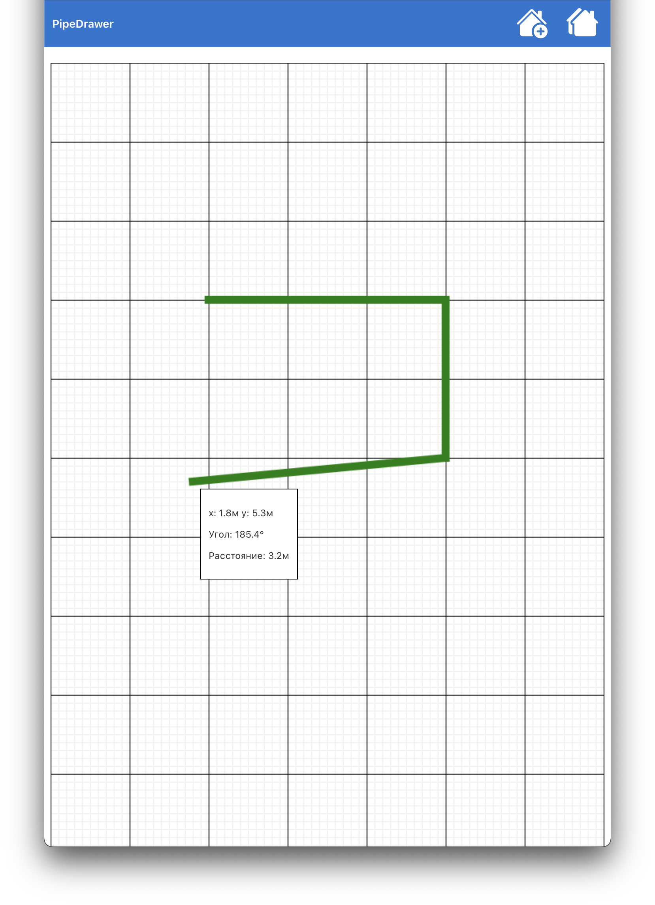
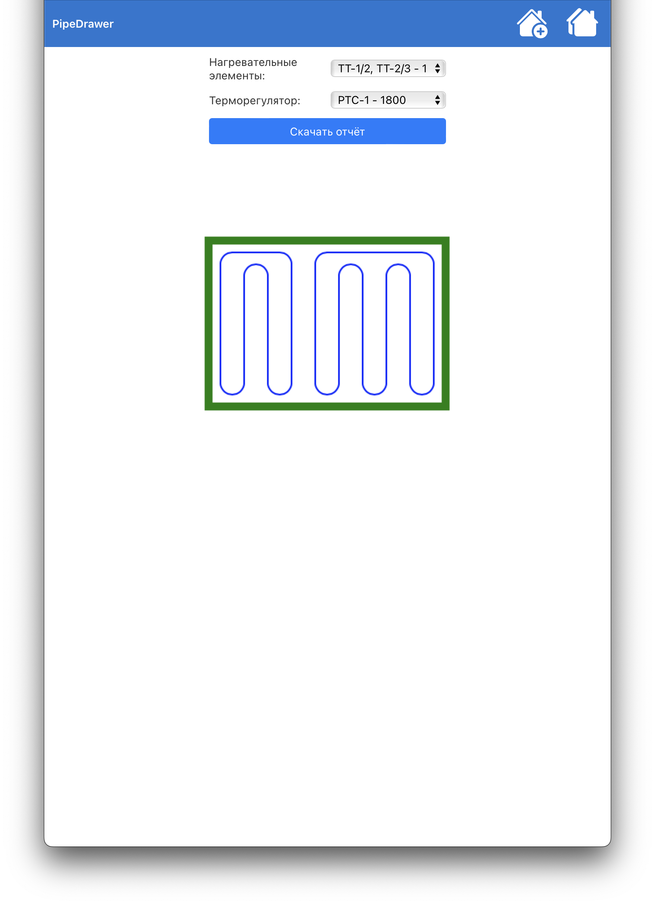
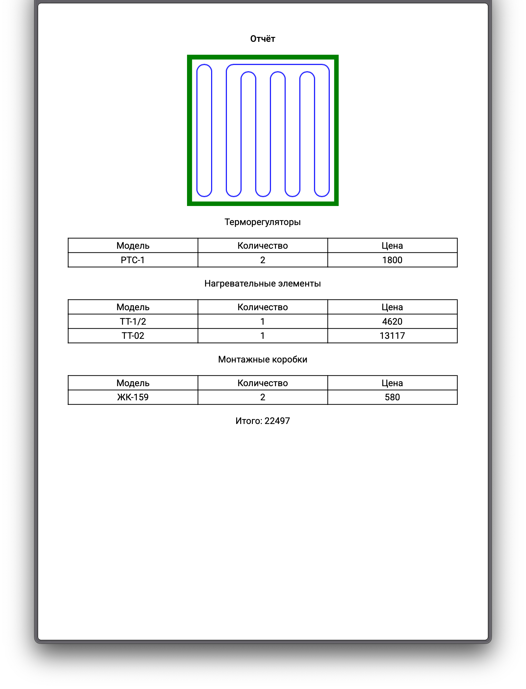

# Основа (MVP) системы визуализации и калькуляции проектов тёплого пола

Система позволяет пользователю изобразить контур помещения на удобной сетке.

Для готового контура приложение вычисляет размеры помещения и подбирает все возможные комбинации нагревательных элементов в рабочем диапазоне мощности. Пользователь может выбрать наиболее подходящую комбинацию, после чего будет сформирован отчёт с изображением раскладки нагревательных элементов этой комбинации и списком всех элементов проекта.

Отчёт доступен для скачивания в формате pdf.

Команда для запуска локальной версии приложения:

> docker-compose up -d --build

По умолчанию приложение работает по адресу localhost:80.
На данный момент для пользователя реализовано 2 основных эндпойнта: localhost/draw для рисования новых контуров,
localhost/rooms для просмотра списка существующих в базе данных контуров и localhost/project?rid={id}
для просмотра проекта помещения с определённым id.